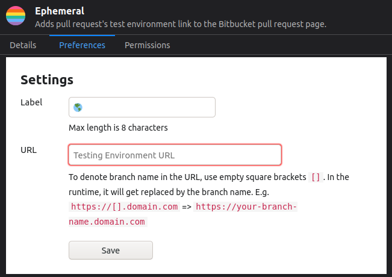

# ephemeral

Ephemeral is a browser extension for Bitbucket.
It adds the pull request's test environment link to the Bitbucket pull request page for quick access. Available for Firefox and Chrome.

## Target Audience
Ephemeral is not ready for the general use case.
It's only usable if the following conditions are met.

* The source code should be hosted on the Bitbucket repositories.
* The pull request must have a testing (preview) environment.
* The pull request's testing environment URL should be identifiable by the branch name.
* You must use Bitbucket's new pull request UI - [How to enable the new pull request interface?](https://community.atlassian.com/t5/Bitbucket-discussions/Try-out-the-new-Bitbucket-Cloud-pull-request-experience-today/td-p/901251)

## Install
* [Firefox add-on](https://addons.mozilla.org/en-US/firefox/addon/ephemeral/)
* [Chrome web store](https://chrome.google.com/webstore/detail/ephemeral/abdhchmphokmjgooncggcbddfbhaabae)

## Setup
Ephemeral is configurable through the options page.

| Option&nbsp;&nbsp;&nbsp;&nbsp;&nbsp;&nbsp;&nbsp; | Default&nbsp;Value&nbsp;&nbsp;&nbsp;&nbsp;&nbsp; | Description |
| :- | :- | :- |
| Label | 🌎 | Link text. Only 8 characters are allowed. |
| URL | - | Testing environment URL. To denote branch name in the URL, use empty square brackets `[]`. In the runtime, it will get replaced by the branch name. E.g. `https://[].domain.com` => `https://your-branch-name.domain.com` |

## Extension in Action

## Credits
* The build script is inspired by the React dev-tools-extensions [build script](https://github.com/facebook/react/blob/master/packages/react-devtools-extensions/build.js)
* [Logo](https://www.flaticon.com/free-icon/rainbow-flag_1880621?term=rainbow&page=1&position=12)

## license
MIT © [Sureshraj](https://github.com/m-sureshraj)
