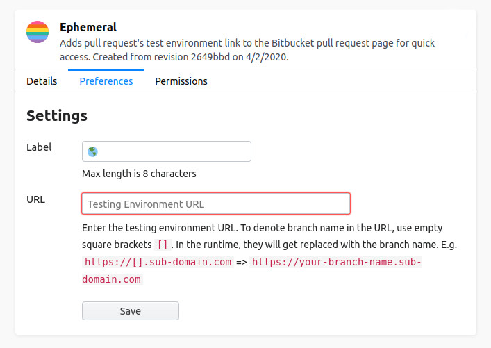
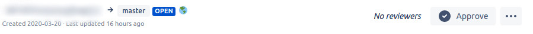
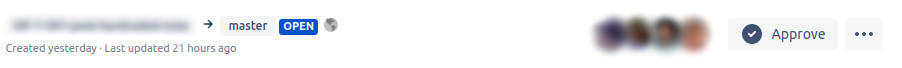

# Ephemeral

Ephemeral is a browser extension for Bitbucket. That adds the pull request's test environment link to the Bitbucket pull request page for quick access. Available for Firefox and Chrome.

## Target Audience
This extension not ready for the general use case. It's only usable if the following conditions are met.

* The source code should have hosted on the Bitbucket repositories.
* The pull request should have a testing (preview) environment.
* The pull request's testing environment URL should be identifiable by the branch name.

## Install
* [Firefox add-on](https://addons.mozilla.org/en-US/firefox/addon/ephemeral/)
* Chrome - Soon to be published

## Setup
You can configure the extension via the options page.

| Option | Default Value | Description |
| :- | :-: | :- |
| Label | 🌎 | Link text. Only 8 characters allowed. |
| URL | - | Testing environment URL. To denote branch name in the URL, use empty square brackets `[]`. In the runtime, they will get replaced with the branch name. E.g. `https://[].sub-domain.com` =>                        `https://your-branch-name.sub-domain.com` |

### Extension in Action

## Credits
* The build script is inspired by the React dev-tools-extensions [build script](https://github.com/facebook/react/blob/master/packages/react-devtools-extensions/build.js)
* [Logo](https://www.flaticon.com/free-icon/rainbow-flag_1880621?term=rainbow&page=1&position=12)

## license
MIT © [Sureshraj](https://github.com/m-sureshraj)
